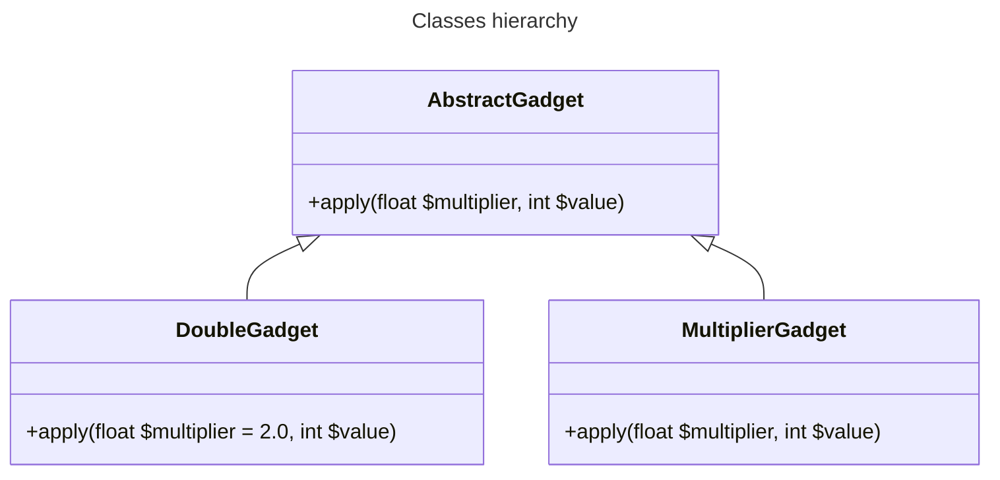

# Test case for rector rule OptionalParametersAfterRequiredRector

The code contains following hierarchy of classes:

One of the classes defines not last parameter of inherited method to be optional, which is deprecated in 8.0.
In this case rector fixes the child class method, but neither the parent method definition, nor all sibling classes to
follow that change.
